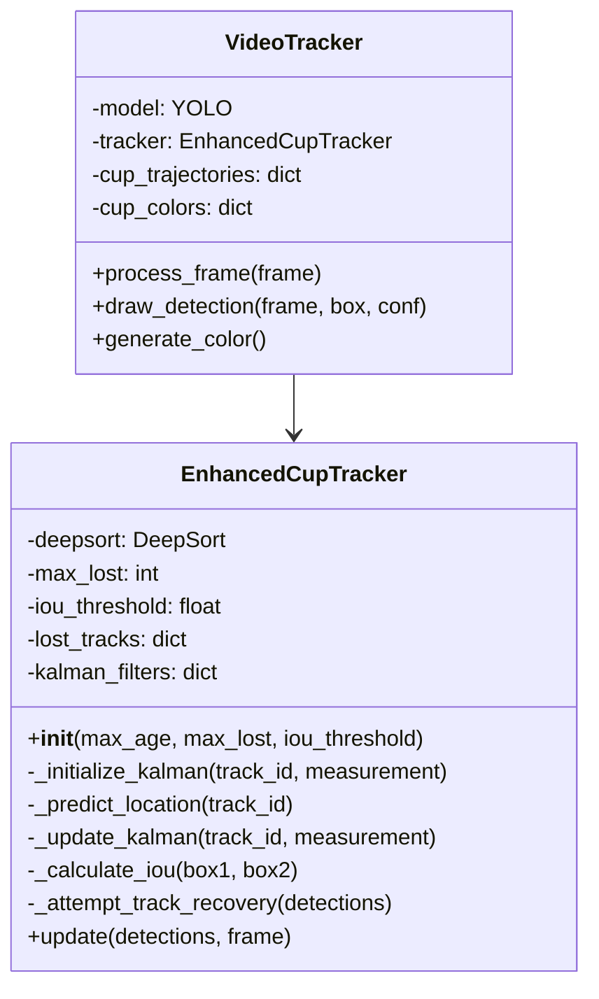
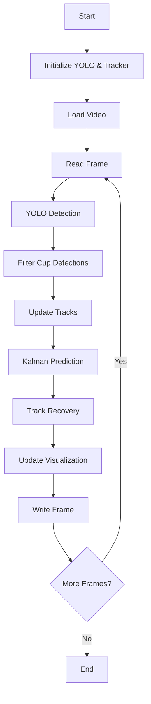
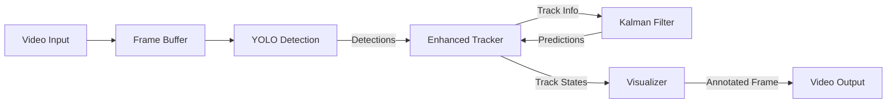

# Technical Solution Documentation

## Implementation Overview

The cup tracking solution integrates multiple technologies for efficient object detection and tracking:

### 1. Core Components

#### Object Detection (YOLOv8)
- Uses YOLOv8 nano model for efficient real-time detection
- Configured for cup/mug detection (COCO class ID 41)
- Confidence threshold: 0.3 for reliable detections
- Processes each frame independently

#### Tracking System (Enhanced DeepSORT)
- Custom `EnhancedCupTracker` implementation
- Parameters:
  - max_age: 30 frames (maximum frames to keep a track alive)
  - max_lost: 5 frames (maximum frames before dropping a track)
  - iou_threshold: 0.3 (intersection over union threshold)
- Maintains persistent track IDs

#### Visualization System
- Dynamic color assignment per track
- Trajectory visualization (50-point history)
- Multiple visual elements:
  - Bounding boxes
  - Confidence scores
  - Track IDs
  - Center points
  - Movement trails
  - Other object detection (gray boxes)

### 2. System Architecture

#### UML Class Diagram


### 3. Design Flow Diagram


### 4. Data Flow Diagram


### 5. Code Architecture

#### Main Components
```python
# Core initialization
- Video I/O setup (OpenCV)
- YOLO model initialization
- EnhancedCupTracker setup

# Data Structures
- cup_trajectories: Dictionary storing position history
- cup_colors: Dictionary mapping track IDs to colors

# Helper Functions
- generate_color(): Creates unique colors for tracks
- draw_detection(): Handles visualization components

# Main Processing Loop
- Frame reading
- YOLO detection
- Track updating
- Visualization
- Video writing
```

### 6. Algorithm Flow

1. **Frame Processing**
   - Read video frame
   - Run YOLOv8 detection
   - Filter cup detections (class ID 41)
   - Store other object detections

2. **Track Management**
   - Update tracks with new detections
   - Maintain track history
   - Handle track creation/deletion
   - Update trajectories

3. **Visualization**
   - Draw detection boxes
   - Update and draw trajectories
   - Add labels and identifiers
   - Handle other object visualization

### 7. Performance Considerations

- YOLOv8 nano model for speed
- Limited trajectory history (50 points)
- Efficient lookup using dictionaries
- Exception handling for robustness
- OpenCV optimized operations

### 8. Key Design Decisions

1. **Track History**
   - Limited to 50 points for memory efficiency
   - FIFO queue implementation
   - Prevents memory growth over time

2. **Color Management**
   - Random color generation
   - Persistent colors per track ID
   - High visibility for tracking

3. **Error Handling**
   - Try-except blocks for robustness
   - Continuous operation despite errors
   - Error logging for debugging
