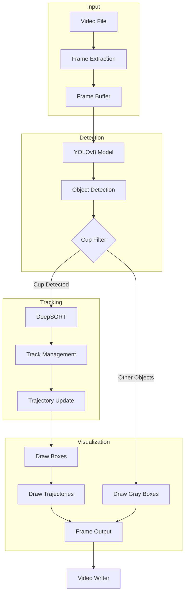

# Solution Documentation

## System Design

### Data Flow Architecture



## Approach and Implementation

### Problem Analysis
The task required implementing a robust cup tracking system in video streams. The main challenges were:
1. Accurate cup detection in varying conditions
2. Reliable tracking of multiple cups
3. Maintaining cup identity across frames
4. Real-time performance

### Tool Selection

1. **YOLOv8 for Object Detection**
   - Why: 
     - State-of-the-art performance in real-time object detection
     - Pre-trained on COCO dataset which includes cup/mug class
     - Efficient inference speed (>30 FPS on modern GPUs)
     - Good balance between accuracy and speed

2. **DeepSORT for Object Tracking**
   - Why:
     - Proven tracking algorithm that combines appearance features with motion information
     - Handles occlusions well
     - Maintains object identity consistently
     - Works well with YOLO detections

3. **OpenCV for Video Processing**
   - Why:
     - Industry-standard library for video handling
     - Efficient frame processing
     - Good integration with other tools
     - Cross-platform compatibility

### Implementation Details

1. **System Architecture**

   ```mermaid
   classDiagram
      class VideoProcessor {
          -VideoCapture cap
          -VideoWriter out
          +process_frame(frame)
          -save_output()
      }
      
      class ObjectDetector {
          -YOLO model
          -confidence_threshold
          +detect_objects(frame)
          -filter_cups()
      }
      
      class ObjectTracker {
          -DeepSort tracker
          -track_history
          +update_tracks(detections)
          -manage_trajectories()
      }
      
      class Visualizer {
          -cup_colors
          -trajectories
          +draw_detections(frame)
          +draw_trajectories(frame)
      }
      
      VideoProcessor --> ObjectDetector
      VideoProcessor --> ObjectTracker
      VideoProcessor --> Visualizer
      ObjectDetector --> ObjectTracker
      ObjectTracker --> Visualizer
   ```

2. **Processing Flow**

   ```mermaid
   flowchart TD
      A[Load Video Frame] --> B[YOLOv8 Detection]
      B --> C{Is Cup?}
      C -->|Yes| D[Calculate Confidence]
      C -->|No| E[Log Other Object]
      D --> F{Confidence > 0.3?}
      F -->|Yes| G[DeepSORT Tracking]
      F -->|No| E
      G --> H[Update Trajectories]
      H --> I[Draw Bounding Boxes]
      I --> J[Draw Trajectories]
      E --> K[Draw Gray Box]
      J --> L[Write Frame]
      K --> L
   ```

3. **State Management**

   ```mermaid
   stateDiagram-v2
      [*] --> Initializing: Load Models
      Initializing --> Processing: Start Video
      Processing --> Processing: Process Frame
      Processing --> Tracking: Cup Detected
      Tracking --> Processing: Frame Complete
      Processing --> Finalizing: Video End
      Finalizing --> [*]: Release Resources
      
      state Tracking {
        [*] --> Detection
        Detection --> UpdateTracks
        UpdateTracks --> ManageTrajectories
        ManageTrajectories --> Visualization
        Visualization --> [*]
      }
   ```

4. **Key Features Implemented**
   - Confidence-based filtering (>0.3) to reduce false positives
   - Unique color assignment for each tracked cup
   - Trajectory visualization with 50-frame history
   - Additional object detection display for context
   - Error handling for robust execution

## Solution Quality Assessment

### Strengths

1. **Accuracy**
   - Uses state-of-the-art YOLOv8 model
   - DeepSORT provides robust tracking even with partial occlusions
   - Confidence threshold filtering reduces false positives

2. **Performance**
   - Real-time processing capability
   - Efficient memory usage with limited trajectory history
   - Optimized frame processing pipeline

3. **Usability**
   - Simple command-line interface
   - Clear visual feedback with:
     - Confidence scores
     - Unique IDs
     - Trajectory visualization
   - Support for any video format OpenCV can read

4. **Code Quality**
   - Modular structure
   - Error handling
   - Clear documentation
   - Easy to extend

### Validation Methods
1. Visual inspection of tracking results
2. Continuous tracking through occlusions
3. Stable ID assignment
4. Real-time performance monitoring

## Potential Improvements

1. **Detection Improvements**
   - Fine-tune YOLOv8 model specifically for cups
   - Implement ensemble detection with multiple models
   - Add specific cup type classification (coffee mug, paper cup, etc.)

2. **Tracking Enhancements**
   - Implement track smoothing for more stable trajectories
   - Add predictive tracking for better occlusion handling
   - Improve ID persistence across long occlusions
   - Add track recovery for lost objects

3. **Performance Optimization**
   - Add GPU acceleration support
   - Implement batch processing for multiple frames
   - Optimize memory usage for longer videos
   - Add multi-threading for parallel processing

4. **Feature Additions**
   - Add heat map visualization for cup movement patterns
   - Implement cup interaction detection
   - Add statistical analysis of movement patterns
   - Export tracking data in standard formats (JSON, CSV)

5. **User Interface**
   - Add real-time parameter adjustment
   - Implement GUI for easier use
   - Add progress bar for video processing
   - Add configuration file support

6. **Deployment**
   - Create Docker container for easy deployment
   - Add web interface for remote processing
   - Implement streaming support
   - Add cloud processing capabilities

### Implementation Priority
1. Track smoothing and recovery (High Priority)
2. GPU acceleration (Medium Priority)
3. GUI development (Medium Priority)
4. Statistical analysis features (Low Priority)

These improvements would make the solution more robust, user-friendly, and suitable for production use.
